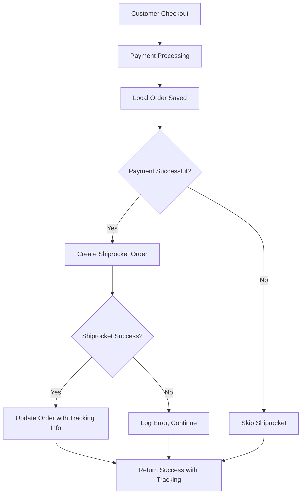

# Shiprocket Integration Documentation

## Overview

This project now includes a comprehensive Shiprocket logistics integration that automatically creates shipping orders after successful payment completion. The integration seamlessly connects your existing order placement flow with Shiprocket's logistics API.

## 🚀 Key Changes Made

### 1. Automated Order Integration (`server/routes/orders.ts`)

**Modified the existing order creation endpoint** to automatically:
- ✅ Create Shiprocket order after successful payment (`paymentStatus === "paid"`)
- ✅ Fetch user phone number from database
- ✅ Map local order data to Shiprocket API format
- ✅ Handle errors gracefully (order still saved locally if Shiprocket fails)
- ✅ Return Shiprocket tracking details in API response

### 2. Enhanced Order Model (`server/models/Order.ts`)

**Added new fields** to store Shiprocket data:
```typescript
shipment_id?: string;              // Shiprocket shipment identifier
awb_code?: string;                 // Air Waybill number for tracking
courier_company_id?: string;       // Courier partner ID
shiprocket_tracking_url?: string;  // Direct tracking URL
order_created_on_shiprocket?: boolean; // Integration status flag
```

### 3. Shiprocket API Helper (`server/utils/shiprocketAuth.ts`)

**Added `createShiprocketOrder()` function** that:
- ✅ Automatically handles authentication with token caching
- ✅ Maps your order data to Shiprocket's required format
- ✅ Sets default values for missing fields (HSN codes, dimensions, etc.)
- ✅ Handles API errors with proper retry logic

## 📋 Integration Flow



## 🔧 Technical Implementation

### Order Creation API Response

**Before Integration:**
```json
{
  "message": "Order created successfully",
  "order": {
    "_id": "order_id",
    "orderNumber": "ORD-123456",
    "total": 2999,
    "status": "confirmed",
    "paymentStatus": "paid"
  }
}
```

**After Integration (Success):**
```json
{
  "message": "Order created successfully",
  "order": {
    "_id": "order_id",
    "orderNumber": "ORD-123456",
    "total": 2999,
    "status": "confirmed",
    "paymentStatus": "paid",
    "shiprocket": {
      "shipment_id": "123456789",
      "awb_code": "AWB123456789",
      "courier_company_id": "45",
      "tracking_url": "https://shiprocket.in/tracking/AWB123456789",
      "integration_status": "success"
    }
  }
}
```

**After Integration (Error):**
```json
{
  "message": "Order created successfully",
  "order": {
    "_id": "order_id",
    "orderNumber": "ORD-123456",
    "total": 2999,
    "status": "confirmed",
    "paymentStatus": "paid",
    "shiprocket": {
      "integration_status": "failed",
      "error": "Shiprocket API error message"
    }
  }
}
```

## 🔍 Data Mapping

### Customer Information
- **Name**: `shippingAddress.firstName + lastName`
- **Email**: `shippingAddress.email` (fallback to user.email)
- **Phone**: `user.phone` (fallback to "1234567890")

### Address Mapping
- **Address**: `shippingAddress.address`
- **City**: `shippingAddress.city`
- **State**: `shippingAddress.state`
- **Pincode**: `shippingAddress.zipCode`
- **Country**: `shippingAddress.country` (defaults to "India")

### Order Items
- **Name**: `item.name`
- **SKU**: `item.productId` (fallback to auto-generated)
- **Quantity**: `item.quantity`
- **Price**: `item.price`
- **Weight**: 0.1 kg (default per item)

### Package Details
- **Dimensions**: 10x10x10 cm (default)
- **Weight**: 0.1 kg × number of items
- **Payment Method**: "Prepaid" (since payment is completed)

## ⚙️ Configuration

### Environment Variables (Already Set)
```bash
SHIPROCKET_EMAIL=spamacc.noreply@gmail.com
SHIPROCKET_PASSWORD=gPwY7@Jt24n%Z$Jv
```

### Default Values Used
- **HSN Code**: 441122 (hardware/bathroom fittings)
- **Pickup Location**: "Primary"
- **Item Dimensions**: "10,10,10" (cm)
- **Default Weight**: 0.1 kg per item

## 🧪 Testing the Integration

### 1. Test Order Creation
1. Go to your website's checkout flow
2. Complete a payment successfully
3. Check the API response for Shiprocket data
4. Verify order is saved with tracking information

### 2. Manual API Test
```bash
curl -X POST http://localhost:8081/api/orders/create \
  -H "Content-Type: application/json" \
  -H "Authorization: Bearer YOUR_JWT_TOKEN" \
  -d '{
    "paymentIntentId": "test_payment_123",
    "paymentStatus": "paid",
    "items": [{"name": "Test Product", "price": 100, "quantity": 1}],
    "shippingAddress": {
      "firstName": "John",
      "lastName": "Doe",
      "email": "john@example.com",
      "address": "123 Test Street",
      "city": "Mumbai",
      "state": "Maharashtra",
      "zipCode": "400001",
      "country": "India"
    },
    "total": 100
  }'
```

### 3. Check Database
After successful order creation, verify the MongoDB order document contains:
- `shipment_id`
- `awb_code`
- `courier_company_id`
- `shiprocket_tracking_url`
- `order_created_on_shiprocket: true`

## 🛡️ Error Handling

The integration is designed to be **non-blocking**:
- ✅ Local order is always saved first
- ✅ Shiprocket failure doesn't prevent order completion
- ✅ Errors are logged but don't break the user experience
- ✅ Frontend receives clear success/failure status

## 📈 Benefits

1. **Automatic Shipping**: No manual order entry in Shiprocket
2. **Real-time Tracking**: Customers get tracking numbers immediately
3. **Reduced Errors**: Eliminates manual data entry mistakes
4. **Seamless Experience**: Works transparently with existing checkout
5. **Fault Tolerant**: Orders complete even if shipping API fails

## 🔮 Next Steps

The integration is ready for production! You can now:
1. Test the flow with real orders
2. Monitor Shiprocket dashboard for automatically created orders
3. Add frontend components to display tracking information
4. Implement webhook handlers for shipping status updates

## 🚨 Important Notes

- Integration only triggers for `paymentStatus === "paid"`
- Requires valid user phone number in database
- Uses Indian addresses by default (change in code if needed)
- Shiprocket credentials are already configured in `.env`
- All tracking URLs point to Shiprocket's tracking page
